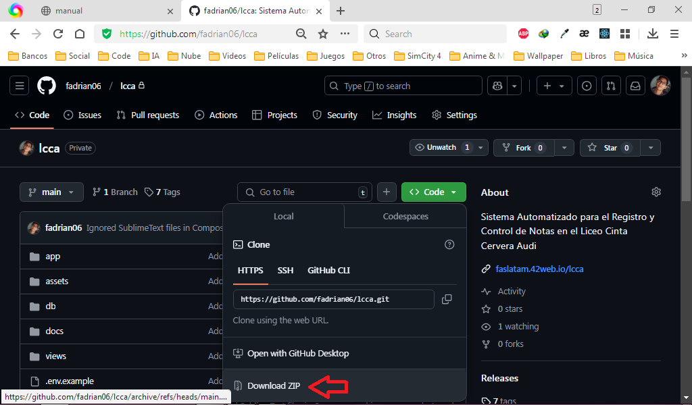
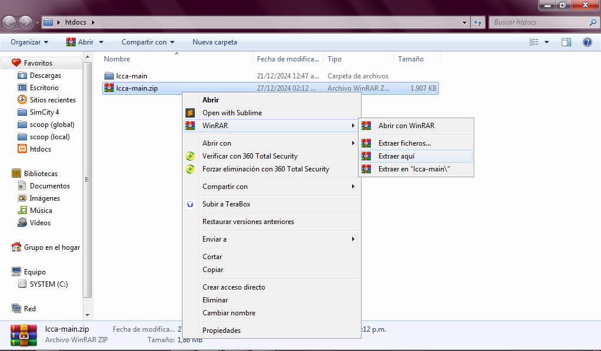
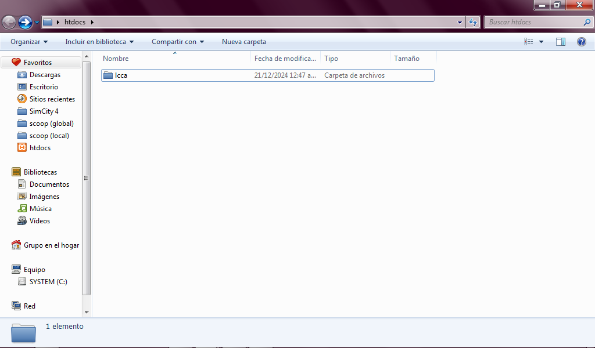
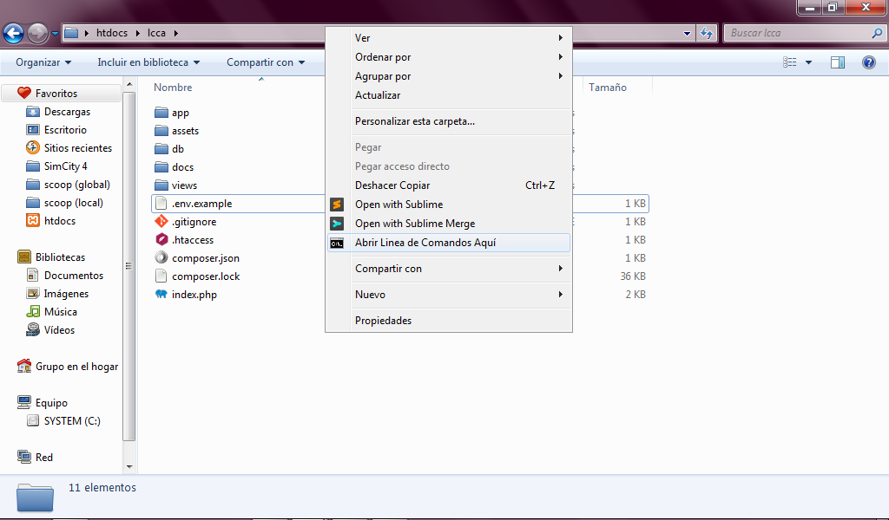
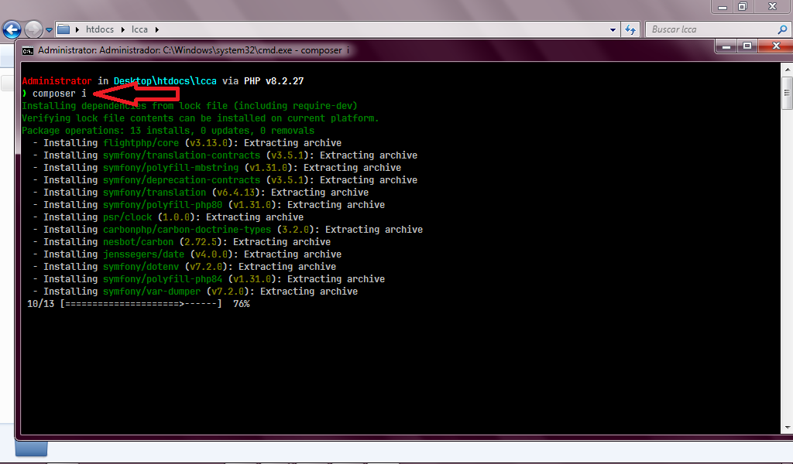
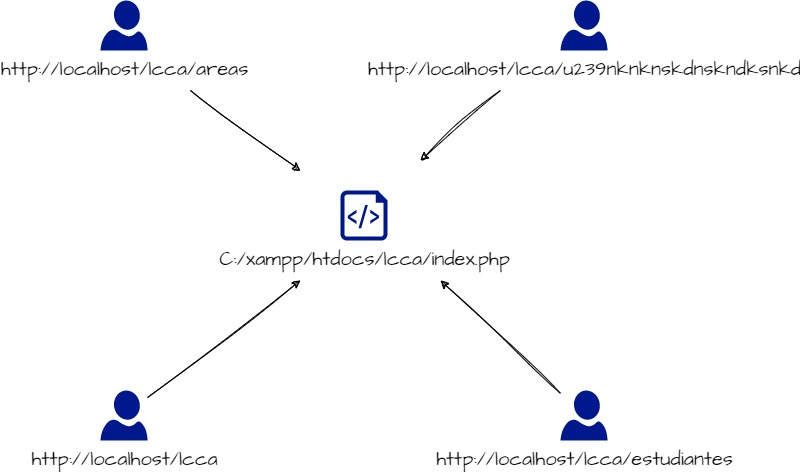

# Bienvenidos al manual del Sistema Automatizado para el Registro y Control de Notas del Liceo Cinta Cervera Audi.

En este manual se explicarán procesos elementales como la instalación del
software, así como una descripción detallada de los módulos que incluye,
sus funciones, su implementación en código fuente y su resultado visual.

Al leer esta guía tendrá una visión completa sobre el software, cómo funciona,
cómo instalarlo y cómo se usa.

## Descripción general

Este sistema automatizado para el registro y control de notas es una herramienta
que facilita la gestión, búsqueda y almacenamiento de datos manejados en el
Liceo Cinta Cervera Audi, como pueden ser la información de sus docentes,
las áreas de formación habilitadas y lo más importante, la información de cada
estudiante que cursa, se gradúa o se retira de la institución.

## Bases tecnológicas

- Este sistema está desarrollado en PHP como lenguaje principal de backend, con
o sin Apache como servidor web.

- Utiliza PDO cómo cliente de conexión a la base de datos, por lo que es
compatible con SQLite o MySQL, teniendo las extensiones habilitadas.

- Utiliza HTML, CSS y JavaScript para el frontend.

- Este sistema implementa la plantilla [Mercury
Admin](https://bootstrapgallery.gumroad.com/l/mercury-bootstrap-free-admin-dashboard)
, ésta a su vez utiliza un tema personalizado de
[Bootstrap](https://getbootstrap.com) 5, íconos de
[Bootstrap Icons](https://icons.getbootstrap.com), [JQuery](https://jquery.com).

## Requisitos

- Tener instalado XAMPP en su computadora.
- Tener instalado Composer en su computadora.
- Habilitar los módulos de Apache en XAMPP.
- Habilitar la extensión de PHP PDO en XAMPP (por defecto está habilitada).
- Habilitar la extensión de PHP SQLite en XAMPP (por defecto está deshabilitada).

#### ¿Cómo habilitar la extensión de PHP SQLite en XAMPP?

1. Abra la carpeta de instalación de XAMPP.
2. Abra la carpeta `php`.
3. Abra el archivo `php.ini`.
4. Busque la línea `;extension=sqlite3` y elimine el punto y coma al inicio.
5. Guarde los cambios y cierre el archivo.
6. Reinicie Apache.

#### ¿Cómo instalar Composer en Windows?

1. Descargue el instalador de Composer desde https://getcomposer.org/Composer-Setup.exe
2. Ejecute el instalador.
3. Reincie su computadora.
4. Abra una ventana de CMD y ejecute el comando `composer --version`.

## Instalación en XAMPP

Para cualquier concepto de instalación desconocido, consulte el glosario.

1. Descargue el repositorio del sistema desde GitHub https://github.com/fadrian06/lcca/archive/refs/heads/main.zip



2. Descomprima el archivo descargado en la carpeta `htdocs` de XAMPP (C:\xampp\htdocs).



3. Elimine ZIP descargado y el sufijo `-main` del nombre de la carpeta
descomprimida por comodidad al accederla en la URL.



4. Entre a la carpeta lcca y abra una ventana de CMD manteniendo presionada la
tecla `Shift` y haciendo clic derecho en un espacio vacío de la carpeta.



5. Ejecute el comando `composer i` para instalar las dependencias de la aplicación



6. Ejecuta el comando para copiar el archivo de configuración:
```cmd
php -r "file_exists('.env') || copy('.env.example', '.env');"

```

7. Ejecuta el comando para configurar la base de datos:
```cmd
php -r "$pdo = new PDO('sqlite:db/lcca.db'); array_map([$pdo, 'query'], explode(';', file_get_contents('db/init.sqlite.sql')));"
```

8. ABRE XAMPP E INICIA APACHE, LUEGO ABRE EL NAVEGADOR Y ESCRIBE `localhost/lcca`.

## Glosario

### Servidor web

Si intentas abrir un archivo en el navegador, este por defecto abrirá con el protocolo
`file://`, que no permite la interpretación de scripts del lado servidor, como podría ser un script de PHP, de Python o
de JavaScript por ejemplo.

¿Y para qué quieres que al abrir un archivo este se ejecute en lugar de solo mostrarse como texto?, pues para poder
desarrollar aplicaciones que ejecuten uno o varios casos de uso y que muestren un resultado en el navegador.

Esto cambia al utilizar un servidor web, cuando tú inicias un servidor web, este necesita 4 cosas:

- Un host, por defecto `localhost`.
- Un puerto abierto, por defecto el puerto 80.
- Un directorio raíz, donde buscará los archivos a ejecutar.
- Un archivo de configuración, que le dirá cómo ejecutar los archivos.

> NOTA: aunque un servidor permite utilizar el protocolo `http://` y `https://`,
> éste por defecto no puede ejecutar scripts del lado servidor, para ello se
> necesita un servidor que tenga habilitado el lenguaje de programación que
> se está utilizando.

El poder configurar tu servidor web para que ejecute scripts del lado servidor
es lo que permite que puedas desarrollar y probar aplicaciones web en tu red.

Ahora, mencioné `localhost` y puerto `80`, vamos a explicar qué significa cada uno:

### ¿Qué es localhost?

Tu dispositivo de red tiene una IP estática (fija, por ejemplo `192.168.1.199`),
o una IP dinámica asignada por el enrutador de tu red (por ejemplo `192.168.1.2`),
PERO hay una IP que los sistemas operativos añaden y que sólo permiten acceder desde un dispositivo hacia sí mismo, algo
así como una IP privada que si coloco en el navegador de otro dispositivo no va a funcionar, sino que los llevará a su
propia IP privada.

Esta IP privada es `127.0.0.1` y la razón por la que sirve usar en el navegador tanto esa IP como el dominio local
`localhost` es porque los sistemas operativos por ejemplo, traen un archivo `hosts` entre sus archivos del sistema y
actúa como una DNS privada, este
se encuentra en `C:\Windows\System32\drivers\etc\hosts` y en Linux en `/etc/hosts`.

Su contenido luce algo así:

```bash
# localhost name resolution is handled within DNS itself.
# 127.0.0.1 localhost
# ::1 localhost
```

Aunque tu servidor web diga que ha iniciado en `localhost`, a nivel de red, sólo puede responder si realizan una
petición al host `127.0.0.1`, usar localhost funciona porque el sistema operativo utiliza esa DNS privada para
convertirlo en 127.0.0.1 y que la petición llegue al servidor correspondiente.

### ¿Qué es un puerto?

Un puerto es un número que se le asigna a un servicio para que pueda ser identificado
y que pueda ser accedido por otros servicios.

Piensa en tu dispositivo conectado a una red como un edificio, este edificio tiene
pisos, cada uno con su nombre y empleados, cada empleado con una puerta asignada.

En cada apartamento de ese edificio hay archivos (imagenes, videos, documentos, etc.)

- Los pisos equivalen a los dominios (`localhost`, `google.com`, etc.)
- Las puertas equivalen a los puertos (`localhost:80`, `localhost:3306`,
`facebook.com:5500`, etc.)
- Los departamentos equivalen a las aplicaciones web, que contienen archivos y que
están esperando que alguien toque su puerta.
- Los empleados equivalen a los lenguajes de programación del lado servidor, que
son los que interpretan los scripts y devuelven una respuesta.

Si llega un cliente y dice, quiero la imagen llamada `imagen.png` del piso `localhost`,
el recepcionista le dirá, ¿en qué apartamento está esa imagen?, el cliente dirá, en el apartamento 80.

Ese 80 es un puerto un poco especial, es el puerto por defecto que se le asigna a los
servidores web, osea que si un cliente llega y dice, quiero la imagen llamada
`imagen.png` del piso `localhost`, el recepcionista lo llevará al apartamento 80.

Por eso en las URLs tu accedes normalmente sin colocar un puerto:

- https://google.com
- https://facebook.com
- https://x.com
- https://github.com
- etc...

Tú puedes tener muchos empleados que atiendan en el piso localhost, pero cada uno en una puerta diferente, por ejemplo:

- `localhost:80` para el servidor web.
- `localhost:3306` para el servidor de base de datos.
- `localhost:5432` para otro servidor de base de datos.
- `localhost:22` para el servidor SSH.
- `localhost:21` para el servidor FTP.
- `localhost:25` para el servidor SMTP.
- `localhost:110` para el servidor POP3.
- `localhost:143` para el servidor IMAP.
- `localhost:443` para el servidor HTTPS.
- `localhost:8080` para otro servidor web.
- y así sucesivamente...

### Apache

Apache es un servidor web, por sí sólo no puede ejecutar scripts del lado servidor,
pero puede ser configurado para que sí lo haga.

Apache es el servidor web más usado en el mundo, es de código abierto y es
desarrollado por la Apache Software Foundation.

Apache puede ser configurado para ejecutar scripts de PHP, Python, Ruby, Perl, etc.

### PHP

PHP es un lenguaje de programación de propósito general.

- Por sí sólo, permite ejecutar scripts PHP desde su intérprete de comandos.
- Mediante extensiones externas se pueden crear aplicaciones de escritorio con PHP.
- Mediante un servidor web, puede ejecutar scripts PHP del lado servidor y devolver
una salida que luego será devuelta por el servidor web hacia el cliente como respuesta HTTP.

PHP forma parte de más del 50% de las páginas web que existen en la actualidad.

#### Forma 1 para usar PHP como servidor web

Tú puedes iniciar un servidor web de desarrollo que interprete scripts PHP, reciba
peticiones y devuelva respuestas usando el comando `php -S localhost:80`.

Este servidor de desarrollo utiliza el CWD (Current Working Directory o directorio
actual donde se esté ejecutando el comando) y lo establece como document root
(documento raíz).

Por ejemplo si abres un CMD en el escritorio de Windows y ejecutas
`php -S localhost:80`, y accedes a `localhost` en el navegador, el servidor
buscará un archivo de índice y lo servirá como página web.

- Si el índice termina en .php como `index.php`, este interpretará el archivo y
devolverá su salida

- Si el índice termina en .html como `index.html`, este sólo devolverá el archivo
como salida.

**DESVENTAJA**: Este servidor sólo funciona para desarrollo de aplicaciones y
no es recomendado para producción.

**VENTAJA**: Es muy fácil de usar y no requiere configuración o integración con
otros servidores web, como puede ser Apache.

Para un servidor en producción que interprete scripts PHP use:

#### Forma 2 para usar PHP en un servidor web

- Instala Apache.
- Instala PHP.
- Configura Apache para que interprete scripts PHP.
- Inicia Apache.
- Coloca tus archivos en el directorio raíz de Apache.

En producción requiere pasos adicionales, como configurar el dominio, el certificado
SSL, la seguridad, la optimización, etc.

En desarrollo sólo son necesarios los pasos antes mencionados, pero hacerlos uno
por uno y que todo funcione no es una tarea para quienes no tienen experiencia
en el tema.

> ES POR ESTO QUE EXISTEN SOLUCIONES TODO EN UNO COMO PUEDEN SER **XAMPP**, **WAMPP**,
> **LARAGON**, entre otros.
>
> Estas soluciones integran Apache, PHP, MySQL, MariaDB, PostgreSQL, etc. en un solo
> paquete, permitiendo que con un solo clic puedas tener un servidor web en tu
> computadora.

### Base de datos

Una base de datos es un sistema que permite almacenar, organizar y recuperar
información de manera eficiente.

Existen varios tipos de bases de datos, pero las más comunes son:

- Bases de datos relacionales, como MySQL, PostgreSQL, SQLite, MariaDB, Oracle,
SQL Server, etc.
- Bases de datos no relacionales, como MongoDB, CouchDB, Cassandra, etc.

Las bases de datos relacionales son las más usadas en aplicaciones web, ya que
permiten relacionar tablas entre sí y realizar consultas complejas.

Las bases de datos no relacionales son usadas en aplicaciones que requieren
escalabilidad y velocidad, pero no necesariamente relaciones entre tablas.

Para el desarrollo de este sistema se ha utilizado SQLite, una base de datos
relacional que permite almacenar la información en un solo archivo, lo que facilita su
distribución y su uso en aplicaciones de escritorio.

### PDO

PDO significa PHP Data Objects, es una extensión de PHP que permite conectarse
a bases de datos de manera genérica.

Con genérica se refiere a que PDO puede conectarse a cualquier base de datos
relacional que tenga un controlador (driver) para PHP.

### FrontEnd - HTML, CSS y JavaScript

El frontend es la parte de una aplicación web que se muestra al usuario.

El frontend se compone de tres tecnologías principales:

- HTML: Lenguaje de marcado que permite estructurar el contenido de una página web.
- CSS: Lenguaje de estilos que permite darle estilo al contenido de una página web.
- JavaScript: Lenguaje de programación que permite interactuar con el usuario y
realizar acciones en la página web.

- Sin HTML, no habría contenido que mostrar en el frontend.
- Sin CSS, el frontend sería un texto plano sin formato.
- Sin JavaScript, el frontend sería estático y no interactuaría con el usuario.

El frontend de este sistema está desarrollado en HTML, CSS y JavaScript, utilizando
la plantilla Mercury Admin, que a su vez utiliza Bootstrap 5, Bootstrap Icons y
JQuery.

### Bootstrap

Bootstrap es un framework de diseño web que permite crear interfaces de usuario
de manera rápida y sencilla.

Bootstrap se compone de varios elementos:

- Un sistema de rejillas que permite crear diseños responsivos.
- Componentes de interfaz de usuario como botones, formularios, alertas, etc.
- Utilidades de CSS que permiten darle estilo a los elementos de la página.

Bootstrap es uno de los frameworks de diseño web más usados en el mundo, ya que
permite crear interfaces de usuario atractivas y funcionales sin necesidad de
conocimientos avanzados de diseño.

### Bootstrap Icons

Bootstrap Icons es una librería de íconos que se integra con Bootstrap y que
permite añadir íconos a los elementos de la página web.

Bootstrap Icons se compone de varios íconos que se pueden añadir a los elementos
de la página web mediante clases de CSS.

### JQuery

JQuery es una biblioteca de JavaScript que permite interactuar con el DOM de una
página web de manera sencilla y rápida.

### DOM

DOM significa Document Object Model, es una representación en forma de árbol de
los elementos de una página web (como títulos, formularios, imágenes, etc.).

El DOM permite interactuar con los elementos de la página web mediante JavaScript,
cambiando su contenido, su estilo, su posición, etc.

### Composer

Composer es un administrador de dependencias para PHP.

Composer permite instalar, actualizar y eliminar dependencias de un proyecto de
PHP de manera sencilla y rápida.

Composer se compone de varios elementos:

- Un archivo `composer.json` que contiene la información de las dependencias del
proyecto.
- Un archivo `composer.lock` que contiene la información de las dependencias
instaladas.
- Un archivo `vendor/autoload.php` que carga las dependencias del proyecto.

Composer es una herramienta esencial para el desarrollo de aplicaciones PHP, ya
que permite gestionar las dependencias de manera eficiente y segura.

### FlightPHP

FlightPHP es un microframework de PHP que permite crear aplicaciones web de manera
sencilla y rápida.

FlightPHP se compone de varios elementos:

- Un enrutador que permite definir rutas y controladores.
- Un sistema de plantillas que permite renderizar las vistas de la aplicación.

### MVC

MVC significa Modelo Vista Controlador, es un patrón de diseño de software que
permite separar la lógica de negocio de la presentación.

MVC se compone de tres elementos:

- El Modelo, que representa los datos y la lógica de negocio de la aplicación.
- La Vista, que representa la presentación de la aplicación.
- El Controlador, que se encarga de gestionar las peticiones del usuario y
comunicarse con el modelo y la vista.

## Guía del código fuente

Imaginemos que instalamos el sistema siguiendo los pasos anteriores y el navegador
nos mostró el formulario de inicio de sesión. ¿Cómo funcionó eso?, veamos:

- Cuando tú haces una petición a `http://localhost` esta llega a Apache de XAMPP
_(desde ahora sólo lo llamaré Apache)_ y te muestra el contenido del `htdocs/index.php`,
pero...

- Cuando tú haces una petición a `http://localhost/lcca` esta llega también a Apache,
pero lee primero el archivo .htaccess cuyo contenido es:

```
RewriteEngine On
RewriteCond %{REQUEST_FILENAME} !-f
RewriteCond %{REQUEST_FILENAME} !-d
RewriteRule ^(.*)$ index.php [QSA,L]
```

- Este archivo `.htaccess` le dice a Apache que si la petición no es un archivo
existente ni un directorio existente, entonces redirija la petición a `index.php`.

Es decir:


