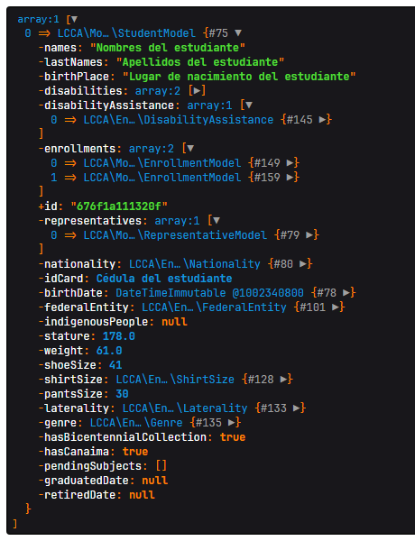
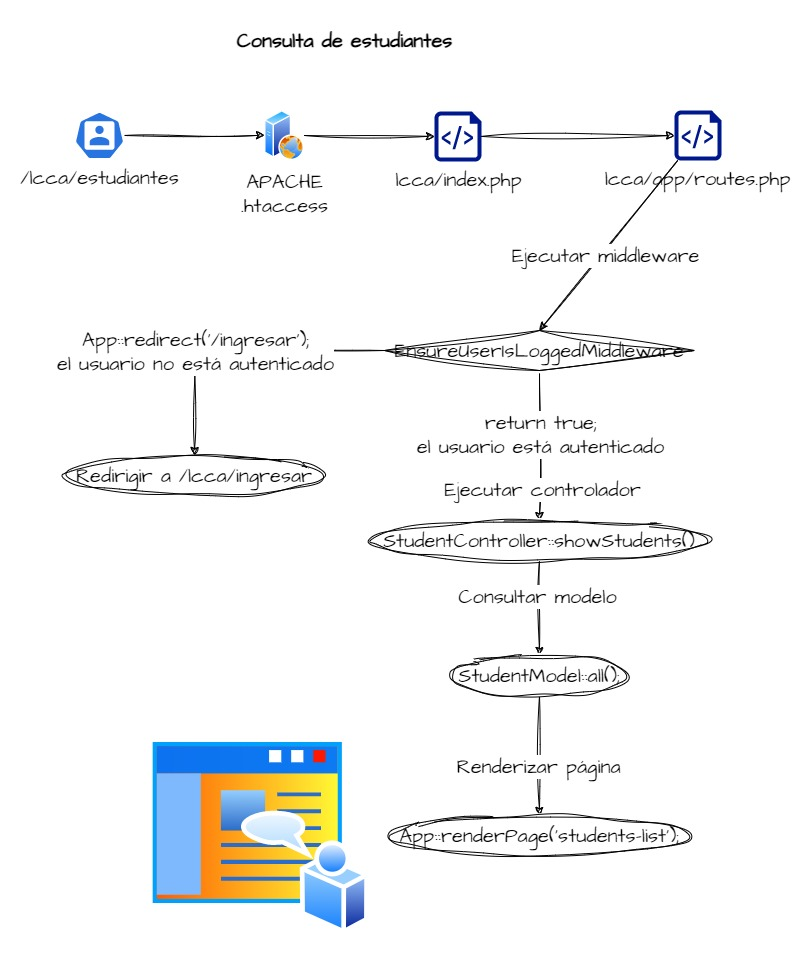

# Bienvenidos al manual del Sistema Automatizado para el Registro y Control de Notas del Liceo Cinta Cervera Audi.

En este manual se explicarán procesos elementales como la instalación del
software, así como una descripción detallada de los módulos que incluye,
sus funciones, su implementación en código fuente y su resultado visual.

Al leer esta guía tendrá una visión completa sobre el software, cómo funciona,
cómo instalarlo y cómo se usa.

## Descripción general

Este sistema automatizado para el registro y control de notas es una herramienta
que facilita la gestión, búsqueda y almacenamiento de datos manejados en el
Liceo Cinta Cervera Audi, como pueden ser la información de sus docentes,
las áreas de formación habilitadas y lo más importante, la información de cada
estudiante que cursa, se gradúa o se retira de la institución.

## Bases tecnológicas

- Este sistema está desarrollado en PHP como lenguaje principal de backend, con
o sin Apache como servidor web.

- Utiliza PDO cómo cliente de conexión a la base de datos, por lo que es
compatible con SQLite o MySQL, teniendo las extensiones habilitadas.

- Utiliza HTML, CSS y JavaScript para el frontend.

- Este sistema implementa la plantilla [Mercury
Admin](https://bootstrapgallery.gumroad.com/l/mercury-bootstrap-free-admin-dashboard)
, ésta a su vez utiliza un tema personalizado de
[Bootstrap](https://getbootstrap.com) 5, íconos de
[Bootstrap Icons](https://icons.getbootstrap.com), [JQuery](https://jquery.com).

## Requisitos

- Tener instalado XAMPP en su computadora.
- Tener instalado Composer en su computadora.
- Habilitar los módulos de Apache en XAMPP.
- Habilitar la extensión de PHP PDO en XAMPP (por defecto está habilitada).
- Habilitar la extensión de PHP SQLite en XAMPP (por defecto está deshabilitada).

#### ¿Cómo habilitar la extensión de PHP SQLite en XAMPP?

1. Abra la carpeta de instalación de XAMPP.
2. Abra la carpeta `php`.
3. Abra el archivo `php.ini`.
4. Busque la línea `;extension=sqlite3` y elimine el punto y coma al inicio.
5. Guarde los cambios y cierre el archivo.
6. Reinicie Apache.

#### ¿Cómo instalar Composer en Windows?

1. Descargue el instalador de Composer desde https://getcomposer.org/Composer-Setup.exe
2. Ejecute el instalador.
3. Reincie su computadora.
4. Abra una ventana de CMD y ejecute el comando `composer --version`.

## Instalación en XAMPP

Para cualquier concepto de instalación desconocido, consulte el glosario.

1. Descargue el repositorio del sistema desde GitHub https://github.com/fadrian06/lcca/archive/refs/heads/main.zip


2. Descomprima el archivo descargado en la carpeta `htdocs` de XAMPP (C:\xampp\htdocs).


3. Elimine ZIP descargado y el sufijo `-main` del nombre de la carpeta
descomprimida por comodidad al accederla en la URL.


4. Entre a la carpeta `lcca` y abra una ventana de CMD manteniendo presionada la
tecla `Shift` y haciendo clic derecho en un espacio vacío de la carpeta.


5. Ejecute el comando `composer i` para instalar las dependencias de la aplicación


6. Ejecuta el comando para copiar el archivo de configuración:
```cmd
php -r "file_exists('.env') || copy('.env.example', '.env');"

```

7. Ejecuta el comando para configurar la base de datos:
```cmd
php -r "$pdo = new PDO('sqlite:db/lcca.db'); array_map([$pdo, 'query'], explode(';',
file_get_contents('db/init.sqlite.sql')));"
```

8. ABRE XAMPP E INICIA APACHE, LUEGO ABRE EL NAVEGADOR Y ESCRIBE `localhost/lcca`.

## Glosario

### Servidor web

Si intentas abrir un archivo en el navegador, este por defecto abrirá con el protocolo
`file://`, que no permite la interpretación de scripts del lado servidor, como podría ser un script de PHP, de Python o
de JavaScript por ejemplo.

¿Y para qué quieres que al abrir un archivo este se ejecute en lugar de solo mostrarse como texto?, pues para poder
desarrollar aplicaciones que ejecuten uno o varios casos de uso y que muestren un resultado en el navegador.

Esto cambia al utilizar un servidor web, cuando tú inicias un servidor web, este necesita 4 cosas:

- Un host, por defecto `localhost`.
- Un puerto abierto, por defecto el puerto 80.
- Un directorio raíz, donde buscará los archivos a ejecutar.
- Un archivo de configuración, que le dirá cómo ejecutar los archivos.

> NOTA: aunque un servidor permite utilizar el protocolo `http://` y `https://`,
> éste por defecto no puede ejecutar scripts del lado servidor, para ello se
> necesita un servidor que tenga habilitado el lenguaje de programación que
> se está utilizando.

El poder configurar tu servidor web para que ejecute scripts del lado servidor
es lo que permite que puedas desarrollar y probar aplicaciones web en tu red.

Ahora, mencioné `localhost` y puerto `80`, vamos a explicar qué significa cada uno:

### ¿Qué es localhost?

Tu dispositivo de red tiene una IP estática (fija, por ejemplo `192.168.1.199`),
o una IP dinámica asignada por el enrutador de tu red (por ejemplo `192.168.1.2`),
PERO hay una IP que los sistemas operativos añaden y que sólo permiten acceder desde un dispositivo hacia sí mismo, algo
así como una IP privada que si coloco en el navegador de otro dispositivo no va a funcionar, sino que los llevará a su
propia IP privada.

Esta IP privada es `127.0.0.1` y la razón por la que sirve usar en el navegador tanto esa IP como el dominio local
`localhost` es porque los sistemas operativos por ejemplo, traen un archivo `hosts` entre sus archivos del sistema y
actúa como una DNS privada, este
se encuentra en `C:\Windows\System32\drivers\etc\hosts` y en Linux en `/etc/hosts`.

Su contenido luce algo así:

```bash
# localhost name resolution is handled within DNS itself.
# 127.0.0.1 localhost
# ::1 localhost
```

Aunque tu servidor web diga que ha iniciado en `localhost`, a nivel de red, sólo puede responder si realizan una
petición al host `127.0.0.1`, usar localhost funciona porque el sistema operativo utiliza esa DNS privada para
convertirlo en 127.0.0.1 y que la petición llegue al servidor correspondiente.

### ¿Qué es un puerto?

Un puerto es un número que se le asigna a un servicio para que pueda ser identificado
y que pueda ser accedido por otros servicios.

Piensa en tu dispositivo conectado a una red como un edificio, este edificio tiene
pisos, cada uno con su nombre y empleados, cada empleado con una puerta asignada.

En cada apartamento de ese edificio hay archivos (imagenes, videos, documentos, etc.)

- Los pisos equivalen a los dominios (`localhost`, `google.com`, etc.)
- Las puertas equivalen a los puertos (`localhost:80`, `localhost:3306`,
`facebook.com:5500`, etc.)
- Los departamentos equivalen a las aplicaciones web, que contienen archivos y que
están esperando que alguien toque su puerta.
- Los empleados equivalen a los lenguajes de programación del lado servidor, que
son los que interpretan los scripts y devuelven una respuesta.

Si llega un cliente y dice, quiero la imagen llamada `imagen.png` del piso `localhost`,
el recepcionista le dirá, ¿en qué apartamento está esa imagen?, el cliente dirá, en el apartamento 80.

Ese 80 es un puerto un poco especial, es el puerto por defecto que se le asigna a los
servidores web, osea que si un cliente llega y dice, quiero la imagen llamada
`imagen.png` del piso `localhost`, el recepcionista lo llevará al apartamento 80.

Por eso en las URLs tu accedes normalmente sin colocar un puerto:

- https://google.com
- https://facebook.com
- https://x.com
- https://github.com
- etc...

Tú puedes tener muchos empleados que atiendan en el piso localhost, pero cada uno en una puerta diferente, por ejemplo:

- `localhost:80` para el servidor web.
- `localhost:3306` para el servidor de base de datos.
- `localhost:5432` para otro servidor de base de datos.
- `localhost:22` para el servidor SSH.
- `localhost:21` para el servidor FTP.
- `localhost:25` para el servidor SMTP.
- `localhost:110` para el servidor POP3.
- `localhost:143` para el servidor IMAP.
- `localhost:443` para el servidor HTTPS.
- `localhost:8080` para otro servidor web.
- y así sucesivamente...

### Apache

Apache es un servidor web, por sí sólo no puede ejecutar scripts del lado servidor,
pero puede ser configurado para que sí lo haga.

Apache es el servidor web más usado en el mundo, es de código abierto y es
desarrollado por la Apache Software Foundation.

Apache puede ser configurado para ejecutar scripts de PHP, Python, Ruby, Perl, etc.

### PHP

PHP es un lenguaje de programación de propósito general.

- Por sí sólo, permite ejecutar scripts PHP desde su intérprete de comandos.
- Mediante extensiones externas se pueden crear aplicaciones de escritorio con PHP.
- Mediante un servidor web, puede ejecutar scripts PHP del lado servidor y devolver
una salida que luego será devuelta por el servidor web hacia el cliente como respuesta HTTP.

PHP forma parte de más del 50% de las páginas web que existen en la actualidad.

#### Forma 1 para usar PHP como servidor web

Tú puedes iniciar un servidor web de desarrollo que interprete scripts PHP, reciba
peticiones y devuelva respuestas usando el comando `php -S localhost:80`.

Este servidor de desarrollo utiliza el CWD (Current Working Directory o directorio
actual donde se esté ejecutando el comando) y lo establece como document root
(documento raíz).

Por ejemplo si abres un CMD en el escritorio de Windows y ejecutas
`php -S localhost:80`, y accedes a `localhost` en el navegador, el servidor
buscará un archivo de índice y lo servirá como página web.

- Si el índice termina en .php como `index.php`, este interpretará el archivo y
devolverá su salida

- Si el índice termina en .html como `index.html`, este sólo devolverá el archivo
como salida.

**DESVENTAJA**: Este servidor sólo funciona para desarrollo de aplicaciones y
no es recomendado para producción.

**VENTAJA**: Es muy fácil de usar y no requiere configuración o integración con
otros servidores web, como puede ser Apache.

Para un servidor en producción que interprete scripts PHP use:

#### Forma 2 para usar PHP en un servidor web

- Instala Apache.
- Instala PHP.
- Configura Apache para que interprete scripts PHP.
- Inicia Apache.
- Coloca tus archivos en el directorio raíz de Apache.

En producción requiere pasos adicionales, como configurar el dominio, el certificado
SSL, la seguridad, la optimización, etc.

En desarrollo sólo son necesarios los pasos antes mencionados, pero hacerlos uno
por uno y que todo funcione no es una tarea para quienes no tienen experiencia
en el tema.

> ES POR ESTO QUE EXISTEN SOLUCIONES TODO EN UNO COMO PUEDEN SER **XAMPP**, **WAMPP**,
> **LARAGON**, entre otros.
>
> Estas soluciones integran Apache, PHP, MySQL, MariaDB, PostgreSQL, etc. en un solo
> paquete, permitiendo que con un solo clic puedas tener un servidor web en tu
> computadora.

### Base de datos

Una base de datos es un sistema que permite almacenar, organizar y recuperar
información de manera eficiente.

Existen varios tipos de bases de datos, pero las más comunes son:

- Bases de datos relacionales, como MySQL, PostgreSQL, SQLite, MariaDB, Oracle,
SQL Server, etc.
- Bases de datos no relacionales, como MongoDB, CouchDB, Cassandra, etc.

Las bases de datos relacionales son las más usadas en aplicaciones web, ya que
permiten relacionar tablas entre sí y realizar consultas complejas.

Las bases de datos no relacionales son usadas en aplicaciones que requieren
escalabilidad y velocidad, pero no necesariamente relaciones entre tablas.

Para el desarrollo de este sistema se ha utilizado SQLite, una base de datos
relacional que permite almacenar la información en un solo archivo, lo que facilita su
distribución y su uso en aplicaciones de escritorio.

### PDO

PDO significa PHP Data Objects, es una extensión de PHP que permite conectarse
a bases de datos de manera genérica.

Con genérica se refiere a que PDO puede conectarse a cualquier base de datos
relacional que tenga un controlador (driver) para PHP.

### FrontEnd - HTML, CSS y JavaScript

El frontend es la parte de una aplicación web que se muestra al usuario.

El frontend se compone de tres tecnologías principales:

- HTML: Lenguaje de marcado que permite estructurar el contenido de una página web.
- CSS: Lenguaje de estilos que permite darle estilo al contenido de una página web.
- JavaScript: Lenguaje de programación que permite interactuar con el usuario y
realizar acciones en la página web.

- Sin HTML, no habría contenido que mostrar en el frontend.
- Sin CSS, el frontend sería un texto plano sin formato.
- Sin JavaScript, el frontend sería estático y no interactuaría con el usuario.

El frontend de este sistema está desarrollado en HTML, CSS y JavaScript, utilizando
la plantilla Mercury Admin, que a su vez utiliza Bootstrap 5, Bootstrap Icons y
JQuery.

### Bootstrap

Bootstrap es un framework de diseño web que permite crear interfaces de usuario
de manera rápida y sencilla.

Bootstrap se compone de varios elementos:

- Un sistema de rejillas que permite crear diseños responsivos.
- Componentes de interfaz de usuario como botones, formularios, alertas, etc.
- Utilidades de CSS que permiten darle estilo a los elementos de la página.

Bootstrap es uno de los frameworks de diseño web más usados en el mundo, ya que
permite crear interfaces de usuario atractivas y funcionales sin necesidad de
conocimientos avanzados de diseño.

### Bootstrap Icons

Bootstrap Icons es una librería de íconos que se integra con Bootstrap y que
permite añadir íconos a los elementos de la página web.

Bootstrap Icons se compone de varios íconos que se pueden añadir a los elementos
de la página web mediante clases de CSS.

### JQuery

JQuery es una biblioteca de JavaScript que permite interactuar con el DOM de una
página web de manera sencilla y rápida.

### DOM

DOM significa Document Object Model, es una representación en forma de árbol de
los elementos de una página web (como títulos, formularios, imágenes, etc.).

El DOM permite interactuar con los elementos de la página web mediante JavaScript,
cambiando su contenido, su estilo, su posición, etc.

### Composer

Composer es un administrador de dependencias para PHP.

Composer permite instalar, actualizar y eliminar dependencias de un proyecto de
PHP de manera sencilla y rápida.

Composer se compone de varios elementos:

- Un archivo `composer.json` que contiene la información de las dependencias del
proyecto.
- Un archivo `composer.lock` que contiene la información de las dependencias
instaladas.
- Un archivo `vendor/autoload.php` que carga las dependencias del proyecto.

Composer es una herramienta esencial para el desarrollo de aplicaciones PHP, ya
que permite gestionar las dependencias de manera eficiente y segura.

### FlightPHP

FlightPHP es un microframework de PHP que permite crear aplicaciones web de manera
sencilla y rápida.

FlightPHP se compone de varios elementos:

- Un enrutador que permite definir rutas y controladores.
- Un sistema de plantillas que permite renderizar las vistas de la aplicación.

### MVC

MVC significa Modelo Vista Controlador, es un patrón de diseño de software que
permite separar la lógica de negocio de la presentación.

MVC se compone de tres elementos:

- El Modelo, que representa los datos y la lógica de negocio de la aplicación.
- La Vista, que representa la presentación de la aplicación.
- El Controlador, que se encarga de gestionar las peticiones del usuario y
comunicarse con el modelo y la vista.

### Namespace

LCCA utiliza composer como gestor de dependencias y el estándar `psr-4` para
la autocarga de clases y funciones.

Observa el contenido del archivo `composer.json`

```json
"autoload": {
  "psr-4": {
    "LCCA\\": "app"
  }
}
```

Esta le dice a composer que todas las clases cuyo namespace comience con `LCCA`
será buscado en la carpeta `app`. Es decir que el namespace
`LCCA\Models\StudentModel` se traducirá a un
`require_once 'app/Models/StudentModel.php'`.
<a href="https://www.php-fig.org/psr/psr-4/">Ver más sobre PSR-4</a>

### Controlador

Los controladores del sistema son clases ubicadas bajo el namespace
`LCCA\Controllers` en el directorio `app/Controllers`. Los métodos de estas
clases contienen la lógica que se ejecutará en determinada ruta.

Por ejemplo el controlador `App\Controllers\LoginController` contiene los métodos
estáticos de `showLogin()` y `handleLogin()` que se ejecutarán cuando el usuario
navegue a la URL `/ingresar`

### Middleware

Los middlewares (intermediarios) son funciones que se ejecutan antes o después de
que se ejecute un controlador.

Tomemos por ejemplo el middleware
`LCCA\Middlewares\EnsureUserIsLoggedMiddleware` contiene el siguiente código:

```php
<?php

namespace LCCA\Middlewares;

use LCCA\App;

final class EnsureUserIsLoggedMiddleware
{
  function before()
  {
    if ($_SESSION['loggedUser'] !== []) {
      return true;
    }

    App::redirect('/ingresar', 401);
  }
}
```

- `before()` indica que se ejecutará antes que se ejecute el controlador
correspondiente. Por ejemplo si navegas a la url `/areas`, el controlador que se
ejecutará será `LCCA\Controllers\SubjectController` en su método `showSubjects()`,
pero este sólo lo hará después que el middleware
`LCCA\Middlewares\EnsureUserIsLoggedMiddleware` haya verificado que el usuario
está autenticado.

### API (**A**pplication **P**rogramming **I**nterface)

Una API en un sistema web es un conjunto de rutas que permiten a otros sistemas,
o el mismo sistema web, a interactuar con otros casos de usos que se ejecutan en
2do plano, como puede ser la búsqueda de estudiantes.

Una API se compone de Endpoints y formato de respuesta, que comúnmente es JSON,
para representación universal de objetos, comprensible por cualquier lenguaje de
programación.

Un Endpoint es una URL que se accede mediante un método HTTP (GET, POST, PUT, DELETE)
y que ejecuta un caso de uso específico.

Tomemos por ejemplo el caso de uso de buscar estudiante:


Este sólo es accesible porque me autentiqué con el formulario de ingreso previamente.

Esta información no la recuperas manualmente, cuando insertas una cédula en el campo
cédula del buscador de estudiantes, este empieza a consultar a ese endpoint, recuperando
la información del estudiante en caso de que la encuentre y mostrándola en pantalla
como un enlace a su perfil o a su formulario de reinscripción.


## Guía del código fuente

Imaginemos que instalamos el sistema siguiendo los pasos anteriores y el navegador
nos mostró el formulario de inicio de sesión. ¿Cómo funcionó eso?, veamos:

- Cuando tú haces una petición a `http://localhost` esta llega a Apache de XAMPP
_(desde ahora sólo lo llamaré Apache)_ y te muestra el contenido del `htdocs/index.php`,
pero...

- Cuando tú haces una petición a `http://localhost/lcca` esta llega también a Apache,
pero lee primero el archivo .htaccess cuyo contenido es:

```
RewriteEngine On
RewriteCond %{REQUEST_FILENAME} !-f
RewriteCond %{REQUEST_FILENAME} !-d
RewriteRule ^(.*)$ index.php [QSA,L]
```

- Este archivo `.htaccess` le dice a Apache que si la petición no es un archivo
existente ni un directorio existente, entonces redirija la petición a `index.php`.

Es decir:


## Del index.php al enrutador

Observemos el contenido del `index.php` que se encuentra en la raíz del proyecto:

```php
<?php

use LCCA\App;
use LCCA\Middlewares\EnsureAppIsNotInMaintenanceMiddleware;

require_once 'vendor/autoload.php';
require_once 'app/configurations.php';

App::group('', function (): void {
  require_once 'app/routes.php';
}, [EnsureAppIsNotInMaintenanceMiddleware::class]);

App::start();
```

- `LCCA\App` es la clase principal de la aplicación.
- `LCCA\Middlewares\EnsureAppIsNotInMaintenanceMiddleware` es un middleware que
verifica si la aplicación está en mantenimiento.
- `vendor/autoload.php` carga las dependencias del proyecto.
- `app/configurations.php` carga la configuración de la aplicación.

```php
App::group('', function (): void {
  require_once 'app/routes.php';
}, [EnsureAppIsNotInMaintenanceMiddleware::class]);
```

Carga las rutas `app/routes.php` sólo si la aplicación no está en mantenimiento.

- `App::start();` captura la petición y ejecuta el controlador o middleware
correspondiente a la ruta.

## `app/routes.php`

Este archivo es el responsable de asignar cada URL a un método de controlador,
así como definir los middlewares que se ejecutarán para un grupo de rutas.

Por ejemplo:

```php
App::group('/ingresar', function (): void {
  App::route('GET /', [LoginController::class, 'showLogin']);
  App::route('POST /', [LoginController::class, 'handleLogin']);
}, [EnsureUserIsNotLoggedMiddleware::class]);
```

Indica que las URLs `GET /ingresar` (para ver el formulario) y `POST /ingresar`
(dónde se envían los datos del formulario) estarán protegidos por el middleware
`EnsureUserIsNotLoggedMiddleware` que al verificar que el usuario no se encuentre
autenticado permitirá a la petición poder llegar al controlador `LoginController`
en sus métodos `showLogin` (para GET) o `handleLogin` (para POST)

1. Es decir, si navegas a `/ingresar` y estás autenticado, el middleware te
redigirá al sistema sin mostrarte el login, pero,
2. si no estás autenticado el middleware permitirá a la petición poder llegar al
método `showLogin` del controlador `LoginController` mostrándote finalmente
el formulario de ingreso.

Lo mismo ocurre con el resto de rutas. Salvo que estas estarán protegidas por
otro middleware `EnsureUserIsLogged` que hace lo contrario a `EnsureUserIsNotLogged`,
este permite que la petición llegue al controlador sólo si el usuario se encuentra
autenticado, de lo contrario redirige a la url `/ingresar` repitiendo los puntos
1 y 2 explicados anteriormente.

Explicado todo lo anterior ahora si procedamos con los requisitos del sistema:

## Requisitos del sistema

Antes de explicar los requisitos primero analicemos la base de datos:

Este es el **Modelo Relacional**:


- Las tablas `Usuarios`, `Materias`, `Representantes` y `Estudiantes` son las
tablas fuertes (que no dependen de otra tabla) y almacenan la
información de cada entidad manejada por el sistema y sus casos de uso.

- La tabla `HistorialRepresentantes` es una tabla pivote (que sólo depende de
otras tablas) que permite la relación muchos a muchos entre `Estudiantes` y
`Representantes` de forma que un estudiante pueda tener vinculados múltiples
representantes y un representante pueda tener vinculados múltiples estudiantes,
de ahí el que las claves foráneas `id_estudiante` e `id_representante` formen
las combinatorias que representan esas relaciones.

- Lo mismo ocurre con la tabla `MateriasPendiente` que permite que un estudiante
pueda tener muchas materias pendientes y una materia pueda estar pendiente para
muchos estudiantes.

- El resto de tablas `Inscripciones` y `Notas` son tablas débiles (que dependen
de otras tablas) como lo son `Estudiantes`, `Usuarios` y `Materias`.

**Módulos del sistema:**

- Estudiantes
- Representantes
- Inscripciones
- Áreas de aprendizaje (materias)
- Notas
- Usuarios (coordinador y docentes)

### ¿Presenta **autenticación** de usuarios?

El sistema permite la autenticación de usuarios por las credenciales: cédula y
contraseña.

Esta autenticación se logra agrupando un conjunto de rutas por un middleware que
garantice que sólo se puede acceder a esas rutas estando autenticado.

¿Cómo funciona?

El middleware se llama `EnsureUserIsLoggedMiddleware` y se encuentra en el archivo
`app/Middlewares/EnsureUserIsLoggedMiddleware.php`, cómo mencionaba anteriormente
el uso de middlewares se debe a extraer lógica previas a la ejecución de
un controlador, de forma que no haya que repetir código de verificación por cada
controlador.

```php
<?php

namespace LCCA\Middlewares;

use LCCA\App;

final class EnsureUserIsLoggedMiddleware
{
  function before()
  {
    if ($_SESSION['loggedUser'] !== []) {
      return true;
    }

    App::redirect('/ingresar', 401);
  }
}
```

- `before()` indica que se ejecutará antes que cualquier controlador en el grupo
de rutas donde se utilice.
- `$_SESSION['loggedUser']` contiene la información del usuario una vez esté
autenticado, EN CASO QUE NO LO ESTÉ `$_SESSION['loggedUser']` será `[]` ignorando
el bloque `if` y redireccionando a la URL `/ingresar` donde se te mostrará el
formulario de ingreso.

Este middleware se utiliza en el archivo `app/routes.php` agrupando todas las rutas
protegidas del sistema:

```php
App::group('', function (): void {
  // ...rutas protegidas del sistema (Web)
}, [EnsureUserIsLoggedMiddleware::class]);

App::group('/api', function (): void {
  // ...endpoints protegidos de la API del sistema
}, [EnsureUserIsLoggedMiddleware::class]);
```

Hay rutas que no están protegidas por ese middleware `EnsureUserIsLoggedMiddleware`
como las urls `/ingresar` por razones lógicas: la aplicación fallaría por una
redirección infinita. Sin embargo el acceso a esas otras rutas está verificado por
otro middleware, uno que haga lo contrario, que garantice que el usuario NO ESTÁ
AUTENTICADO, cuyo nombre es `EnsureUserIsNotLoggedMiddleware` con el siguiente código:

```php
<?php

namespace LCCA\Middlewares;

use LCCA\App;

final class EnsureUserIsNotLoggedMiddleware
{
  function before()
  {
    if ($_SESSION['loggedUser'] === []) {
      return true;
    }

    App::redirect('/');
  }
}
```

Observa como la comparación es opuesta a la del `EnsureUserIsLoggedMiddleware`,
`===` vs. `!==`, por lo que autoriza el acceso al controlador sólo a usuarios
que no estén autenticados, aquellos que ya se hayan autenticado serán redirigidos
directamente al sistema.

También observa como se utiliza agrupando rutas que se consideran públicas en el
sistema (accesibles por usuarios no autenticados):

```php
App::group('/perfil/recuperar(/@idCard:[0-9]+)', function (): void {
  // ...rutas para la recuperación del perfil
}, [EnsureUserIsNotLoggedMiddleware::class]);

App::group('/ingresar', function (): void {
  // ...rutas del ingreso
}, [EnsureUserIsNotLoggedMiddleware::class]);
```

En resúmen:

- El acceso a cualquier ruta pública es garantizado _(Ensure)_ por el middleware
`EnsureUserIsNotLoggedMiddleware`, rutas públicas como pueden ser `/ingresar`,
`/registrarse`, `/salir` y `/perfil/recuperar/@cedula`
- El acceso a cualquier ruta protegida es garantizado por el middleware
`EnsureUserIsLoggedMiddleware`, rutas protegidas como los endpoints de la API,
ò las rutas `/estudiantes`, `/areas`, `/respaldar`, `/restaurar`, etc.

### ¿El sistema **Autoriza** los usuarios (inicia sesión según privilegio)?

Actualmente no tiene asignado casos de usos específicos por rol, es decir, casos
de uso que sólo un coordinador pueda ejecutar y que un docente no, por ejemplo.

Esto es debido a que actualmente la coordinación del Liceo Cinta Cervera Audi lleva
el control de toda la información que se subirá al sistema como por ejemplo.

- La carga de notas se realiza anualmente, los docentes hacen llegar las calificaciones
a la dirección y es la coordinadora quien carga la información de cada estudiante.

- La inscripción y reinscripción de estudiantes también corresponde únicamente al
coordinador, su firma va impresa en todos los formularios de inscripción, aunque
este exija la firma de un docente.

En resúmen, aunque está implementado el módulo de docentes (consulta, registro
y eliminación) este no estará activo y todos los casos de uso corresponderán al
coordinador, mientras el sistema evoluciona y la dirección del Liceo Cinta Cervera
Audi destina casos de uso específicos a sus docentes, además de sólamente proporcionar
las notas cada final de período escolar.

### ¿Permite **Insertar** registros a la base de datos desde los módulos?

- El sistema actualmente permite la inserción de usuarios, tanto coordinadores
como docentes.

- El sistema actualmente permite la inserción de áreas de aprendizaje (materias).

- El sistema actualmente permite la inserción de estudiantes, representantes e
inscripciones, no directamente, sino a través del módulo de inscripciones.

**Por ejemplo para registrar un coordinador:**

Para acceder al formulario de registro de un coordinador debes ir a la URL
`/registrate`, esta será accesible de manera pública temporalmente hasta qué
se decida qué método aplicar para que sólo exista una única cuenta de coordinador.

Estos métodos podrían ser:

- Proteger el acceso a ese caso de uso con una clave maestra secreta, conocida
sólo por la dirección de la institución.

- Proteger el acceso a ese caso de uso cuando ya se encuentra un coordinador activo
en el sistema, de forma que no se cree otro coordinador hasta que el anterior
desactive su cuenta (pero este caso de uso no está implementado).

- Dejar que se registren coordinadores libremente pero que la información no se
comparta entre ellos, es decir, que el sistema permita gestionar varias escuelas
a la vez, cada una con su propio listado de áreas, estudiantes y docentes. Como
la información corresponde a un único coordinador, la información de su institución
sólo será visible para ese coordinador.

Por ejemplo: Si se registrara un coordinador con su cédula y contraseña para el liceo
Cinta Cervera Audi y otro coordinador para la escuela Rosa Molas, ambos coordinadores
no verían la misma información, al igual que sus docentes, sólo verían la información
correspondiente a la de su institución.

Siguiendo con lo anterior, una vez accedido a la url `/registrate` la petición llegará
a Apache, el cual la redigirá al `ìndex.php`, este a su vez al archivo `app/routes.php`
y este al middleware/controlador correspondiente:

```php
App::group('/registrarse', function (): void {
  App::route('GET /', [AccountRegistrationController::class, 'showRegistration']);
  App::route('POST /', [AccountRegistrationController::class, 'handleRegistration']);
});
```

- `GET /` al estar bajo el grupo `/registrarse` se traduce finalmente a
`GET /registrarse` que será atendido por el método `showRegistration` del controlador
`AccountRegistrationController`, este mostrará la vista que contiene el formulario
de registro de coordinador.

```php
final readonly class AccountRegistrationController
{
  static function showRegistration(): void
  {
    App::renderPage('account-registration', 'Regístrarse', 'mercury-login');
  }

  // ...otros métodos del controlador
}
```

Esa vista llamada `account-registration` se encuentra en
`views/pages/account-registration.php` ya que el motor de plantillas está
configurado para buscar cualquier vista en la carpeta raíz `views`, esto debido
a que `Flight` (el framework) está configurado para buscar las vistas en esa carpeta.

El método `renderPage()` de la clase `App` concatena en la ruta del archivo `/pages`
quedando finalmente `views/pages/account-registration.php`, mismo proceso para
renderizar otras vistas.

- El último parámetro cuyo valor es `mercury-login` indica la plantilla HTMl que
se usará para envolver el formulario de registro, de ingreso y recuperación de
contraseña, para que todos compartan el mismo diseño por ejemplo.

Cuando el formulario se envía mediante método `POST` a la URL `/registrarse`
esta petición ejecuta el método `handleRegistration` del controlador
`AccountRegistrationController` que verifica los campos del formulario y si
estos son válidos llama al método `create` del modelo `UserModel` pasándole la
información del registro:

```php
UserModel::create(
  $userData->name,
  $userData->idCard,
  $userData->password,
  Role::Coordinator->value,
  $userData->secretQuestion,
  $userData->secretAnswer
);
```

Este es el que finalmente creará un objeto de tipo `UserModel` y lo insertará
en la base de datos.

```php
$stmt = App::db()->prepare('
  INSERT INTO users(id, name, idCard, password, role, secretQuestion,
  secretAnswer) VALUES (:id, :name, :idCard, :password, :role,
  :secretQuestion, :secretAnswer)
');

$stmt->execute([
  ':id' => $userModel->id,
  ':name' => $userModel->name,
  ':idCard' => $userModel->idCard,
  ':password' => $userModel->password,
  ':role' => $userModel->role->value,
  ':secretQuestion' => $userModel->secretQuestion,
  ':secretAnswer' => $userModel->secretAnswer
]);
```

La razón de usar modelos en lugar de las consultas SQL directamente, es que
cada modelo sería responsable del cómo se inserta, modifica, consulta o elimina
la información. Por ejemplo es el módelo el responsable de encriptar la clave de
un usuario, así como la creación de su identificador (ID). Lo mismo aplica para
otros modelos como `RepresentantiveModel::create`, `StudentModel::create` y
`SubjectModel::create`, cada uno ejecutado al acceder a la URL correspondiente:

- `POST /registrarse` para registrar un coordinador.
- `POST /inscribir` para inscribir a un estudiante.
- `POST /docentes/registrar` para registrar a un docente.
- `POST /areas` para registrar una materia.
- `POST /estudiantes/@id/reinscribir` para reinscribir al estudiante del id: @id,
es decir, `/estudiantes/29392329/reinscribir` procesa la reinscripción del estudiante
con id: 29392329 si ya se encuentra registrado en la base de datos.

### ¿El sistema **Permite** consultar datos registrados?

La consulta de los registros se realiza en los modelos correspondientes.
Estos se encargan de mapear toda la información de base de datos en un objeto
PHP que pueda ser consultado fácilmente por una vista dónde lo necesita. El cómo
llega este objeto a la vista es gracias al controlador correspondiente. Tomemos
por ejemplo el caso de uso de consultar estudiantes.

- Para acceder a este debes estar autenticado (tu petición debe haber pasado por
el middleware `EnsureUserIsLoggedMiddleware` que como su nombre indica, garantiza
que sólo usuarios autenticados puedan acceder).

- La URL a la que debes acceder es `/estudiantes`, se puede colocar directamente
en el navegador o accederla mediante el panel lateral del sistema:


Esta petición (después de pasar por el middleware de autenticación) acabaría
llegando al método `showStudents` del controlador `StudentController` como está
programado en el `app/routes.php`

```php
App::group('', function (): void {
  // ... otras rutas

  App::group('/estudiantes', function (): void {
    App::route('GET /', [StudentController::class, 'showStudents']);

    // ... más rutas /estudiantes
  });
}, [EnsureUserIsLoggedMiddleware::class]);
```

Este controlador renderiza la vista correspondiente, pasandole los datos de los
estudiantes extraídos del modelo:

```php
final readonly class StudentController
{
  static function showStudents(): void
  {
    $students = StudentModel::all();

    App::renderPage(
      'students-list',
      'Estudiantes',
      'mercury-home',
      compact('students')
    );
  }

  // ...otros métodos del controlador de estudiantes
}
```

- `students-list` representa el archivo `views/pages/students-list.php`
- `mercury-home` representa la plantilla HTML que contiene las partes compartidas
entre páginas, como el menú superior, el ménu lateral y el pie de página.
- `compact('students')` se traduce a `['students' => $students]`, la clave del array
`'students'` creará una variable `$students` accesible por la página `students-list`

Esta variable representa una lista de objetos de tipo `StudentModel` que luce más
o menos así:



El mismo proceso aplica para la consulta de áreas de aprendizaje, o la consulta
de docentes, o la consulta del perfil de un estudiante.

Todo se resume a:

- `Apache` recibe la petición.
- `Apache` la redirige al `index.php`.
- El `index.php` la redirige al `app/routes.php`.
- El `routes.php` hace coincidir la URL con una definición de ruta. Por ejemplo si
la url es `/estudiantes` y `routes.php` define que esa url está protegida por varios
middleware y asignada a un controlador, primero se ejecutarán todos los middlewares y
estos pueden dar paso a que la petición llegue a un controlador o sea rechazada y
muestre algún error o la petición sea redireccionada a otra url.
- El controlador cuando es ejecutado, consulta datos del modelo.
- El controlador renderiza una vista y le pasa los datos del modelo para que
los muestren en una página, y así sucesivamente.



### ¿En todos los Módulos se pueden **Modificar** los registros?

- El sistema tiene implementada la modificación de un estudiante, esta se realiza
mediante la reinscripción (modificando alguno de sus datos) o mediante un formulario
de edición en su perfil (accesible a través de la url `/lcca/estudiantes/@id/editar`)

- La edición de representantes también se realiza durante la reinscripción de la
siguiente manera:

1. Si modificas algún dato del representante que no sea la cédula, ese representante
será actualizado en base de datos con la nueva información proporcionada a través
de ese formulario de reinscripción.
2. Si modificas la cédula durante la reinscripción, el sistema insertará otro
representante en la base de datos y lo asignará como actual al estudiante reinscrito,
dejando al antiguo representante como un registro antiguo presente en el historial
de representantes de ese estudiante.

- El sistema permite la modificación de un área de aprendizaje mediante la url
`/lcca/areas/@id/editar`, accesible mediante el enlace en el listado de áreas:


Al ingresar nueva información en el formulario de edición, esa área de aprendizaje
será actualizada en todos los lugares.

- El sistema no implementa una modificación directa de docentes, en su lugar,
cada docente puede editarse su propio perfil, por si al momento de ser registrado se
ingresó algún dato incorrecto, si desea cambiar su contraseña o su pregunta y respuesta
de seguridad.

En resumen:

✔ Implementada la edición de perfil de usuario, pero cada usuario edita su propio perfil.

✔ Implementada la edición de áreas de aprendizaje.

✔ Implementada la edición de estudiantes desde el enlace en el perfil del estudiante.

✔ Implementada la edición de un representante, modificando su información (menos la cédula)
durante la reinscripción de un estudiante.

### ¿En todos los Módulos se pueden **Eliminar** los registros?

El sistema actualmente no implementa la eliminación de registros en todos los
módulos, sin embargo es posible:

✔ Eliminar el perfil de un docente desde el botón `Eliminar` en el listado de
docentes, aunque el docente puede eliminarse su propia cuenta pulsando en
`Eliminar cuenta` en la configuración de su perfil de usuario.

✔ Eliminar un área de aprendizaje que no haya sido asignada como materia pendiente
a algun estudiante, ni tampoco haya tenga notas asociadas a ella, si se intenta
eliminar en estos casos el sistema lanzará un error que aún no ha sido tratado
para que sea amigable al usuario.

- Aún no está implementado el caso de uso de eliminar a un representate,
sin embargo se puede desvincular de un estudiante, pulsando en la `X` (Ya no me representa)
en el listado de representantes visible en el perfil de estudiante.

- Aún no está implementado la eliminación de estudiantes, sin embargo se puede marcar
a un estudiante como `Retirado` desde su perfil o desde el listado de estudiantes,
de forma que este no aparezca en el listado normal de estudiantes, sino en una sección
destinada a estudiantes retirados, pudiendo posteriormente ser reinscrito nuevamente
al sistema sin haber perdido toda su información personal y académica.

### ¿El sistema genera **Reportes** por pantalla y por Impresión?

Actualmente el sistema no implementa reportes ni por pantalla ni por impresión.

- Aunque se planea implementar para comodidad de la dirección:
un reporte imprimible con el formulario de inscripción o reinscripción de un estudiante
con las firmas digitales del docente (el coordinador),
el representante y el estudiante al pie de la inscripción.

- Así como también un reporte con las calificaciones de un estudiante para un período
escolar especificado, además de un reporte final de notas certificados accesible
sólo para estudiantes graduados.

### ¿El sistema permite **Respaldar** y **Restaurar** la Base de Datos?

El sistema implementa el respaldo y restauración de la base de datos para SQLite o
MySQL, accesible a través de los enlaces del menú lateral (accesibles actualmentes
para todos los usuarios).

El proceso de respaldo y restauración difiere de la base de datos que esté usando
el sistema:

#### Si la base de datos es SQLite

Esta normalmente se ubica en el archivo `db/lcca.db` (ver la variable de entorno
`PDO_DSN` del archivo `.env`).

- El proceso de respaldar es tan sencillo como crear una copia de ese archivo.

```php
[, $dbPath] = explode('sqlite:', $_ENV['PDO_DSN']);

copy($dbPath, "$dbPath.backup");
```

Esto creará por ejemplo un archivo `db/lcca.db.backup`, el cual es una copia exacta de
`db/lcca.db`.

- El proceso de restauración requiere un paso adicional el cual es cerrar todas
las instancias activas de conexión a esa base de datos, de forma que el archivo
pueda ser liberado de lecturas y pueda esté disponible su escritura:

```php
self::$db = null;

Database::restore();
```

El método `restore()` de la clase `Database` cuando detecta que la base de datos es
SQLite ejecuta lo siguiente:

```php
[, $dbPath] = explode('sqlite:', $_ENV['PDO_DSN']);
$backupPath = "$dbPath.backup";

copy($backupPath, $dbPath);
```

Este copia el archivo `db/lcca.db.backup` al archivo `db/lcca.db` sobreescribiendo
toda la información que había almacenada con la que había en la copia de seguridad.

- El sistema actualmente no permite exportar el esquema SQL necesario para
inicializar las tablas con otro motor de base de datos.

#### Si la base de datos es MySQL

El proceso de respaldo se realiza exportando un volcado del esquema SQL actual
usando `mysqldump` y guardándolo a un archivo `db/backup.mysql.sql`

```php
$dbParams = explode(';', explode('mysql:', $_ENV['PDO_DSN'])[1]);

foreach ($dbParams as $index => $param) {
  [$name, $value] = explode('=', $param);

  $dbParams[$name] = $value;
  unset($dbParams[$index]);
}

$backupPath = dirname(__DIR__) . '/db/backup.mysql.sql';
exec("\"{$_ENV['MYSQLDUMP_PATH']}\" {$dbParams['dbname']} --user={$_ENV['PDO_USER']} --password={$_ENV['PDO_PASSWORD']}", $output);
file_put_contents($backupPath, join(PHP_EOL, $output));
```

El proceso de restauración se realiza leyendo el archivo del volcado previamente
creado y ejecutando una a una las consultas DDL SQL que borran todas las tablas,
las vuelve a crear e inserta los registros presentes en la copia de seguridad:

```php
$backupPath = dirname(__DIR__) . '/db/backup.mysql.sql';
$database = self::autoConnect();

$queries = explode(
  ';',
  file_get_contents($backupPath)
);

foreach ($queries as $query) {
  $database->query($query);
}
```

- El sistema actualmente no permite exportar el esquema SQL necesario para
inicializar las tablas con otro motor de base de datos.

### ¿Los formularios validan los campos de entrada?

No todos los formularios tienen su validación implementada en el backend,
sin embargo la mayoría tienen implementaciones de validación en el frontend aunque
a nivel muy básico.

Como por ejemplo:

```html
<input
  type="number"
  name="idCard"
  required
  class="form-control"
  placeholder="Introduce tu cédula" />

<input
  type="password"
  name="password"
  required
  class="form-control"
  placeholder="Introduce tu contraseña" />
```

Lo cual indica que los campos son requeridos.

O por otro lado:

```phtml
<input
  name="name"
  required
  class="form-control"
  placeholder="Introduce tu nombre"
  pattern="[a-zA-ZáéíóúñÁÉÍÓÚÑ]{3,}"
  title="El nombre sólo puede tener mínimo 3 letras"
  value="<?= $_SESSION['lastData']['name'] ?? '' ?>" />
```

Lo cual valida que el nombre de un usuario sólo contenga mínimo 3 letras, NO NÚMEROS, o

```phtml
<input
  type="password"
  name="password"
  required
  class="form-control"
  placeholder="Introduce tu contraseña"
  pattern="(?=.*\d)(?=.*[A-ZÑ])(?=.*\W).{8,}"
  title="La contraseña debe tener al menos 8 caracteres, un número, un símbolo y una mayúscula"
  value="<?= $_SESSION['lastData']['password'] ?? '' ?>" />
```

Que valida que una nueva contraseña de usuario contenga mínimo una mayúscula,
un dígito y un símbolo, así como también una cantidad mínima de 8 caracteres
(el estándar de contraseñas seguras)

Algunas validaciones si están implementadas en el backend, sin embargo está en
desarrollo el desarrollo del 100% de los formularios para garantizar información
segura y coherente.

> AUNQUE UNA VALIDACIÓN QUE SI ESTÁ IMPLEMENTADA ES A NIVEL DE BASE DE DATOS, la
> la cual rechaza registros duplicados, o que no cumplen el formato deseado
> (como un correo o teléfono inválido o cédulas duplicadas).
> Además de ejecutar todas las consulta de inserción, modificación y eliminación
> con sentencias preparadas, garantizando la evasión de inyecciones SQL desde los
> formularios.

Por ejemplo una restricción de base de datos podría ser:

```sql
idCard INTEGER UNIQUE NOT NULL CHECK (idCard >= 0)
```

Lo cual garantiza que todas las cédulas sean únicas y números enteros positivos.

O este otro ejemplo:

```sql
names VARCHAR(255) NOT NULL CHECK (LENGTH(names) >= 3),
lastNames VARCHAR(255) NOT NULL CHECK (LENGTH(lastNames) >= 3),

UNIQUE (names, lastNames)
```

Lo cual garantiza que todos los nombres y apellidos sean requeridos, deban tener
mínimo 3 caracteres y la combinación de ambos deba ser única en cada tabla.

Es decir aceptará: Manuel Rodríguez, Manuel Zapata y Carlos Rodríguez pero
no dos veces Manuel Rodríguez.

Adicional a nivel de backend, las propiedades de los modelos sólo aceptan datos
de un tipo específico que puede ser un escalar o una instancia de otro objeto o ENUM.

```php
final readonly class EnrollmentModel
{
  private function __construct(
    public string $id,
    public StudentModel $student,
    public UserModel $teacher,
    public StudyYear $studyYear,
    public Section $section,
    private DateTimeInterface $date
  ) {}

  // ...otros métodos del modelo de inscripción
}
```

Su constructor garantizar que la propiedad `$id` sólo pueda ser de tipo string,
el `$student` sólo pueda ser una instancia válida del `StudentModel` y así sucesivamente.

- Aunque no está implementado el tratamiento de errores que lanza PHP o la base de
datos cuando los datos no cumplen las restricciones de tipos o patrones.
